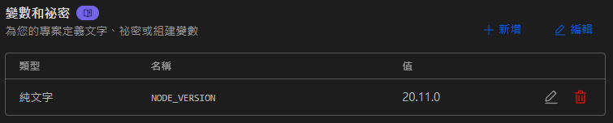

# 🚀 使用 Hexo 打造專屬 104 個人履歷

這份指南將帶領你使用 Hexo 框架快速架設個人履歷，並成功發佈到 Cloudflare Pages。✨

---

## 📖 什麼是 Hexo？

Hexo 是一個基於 Node.js 開發的快速、簡潔且高效的靜態網站框架，非常適合用於製作部落格或個人履歷。

## 🛠️ 安裝環境需求

在開始之前，請確保你的電腦已安裝以下工具：

- **Node.js** (建議版本 v20 以上)
- **Git** 版本控制系統

## 📥 安裝 Hexo CLI

首先，透過 npm 全域安裝 Hexo 指令工具：

```bash
npm install hexo-cli -g
```

安裝完成後，可以檢查版本號確認是否安裝成功：

```bash
hexo version
# 或者簡寫為
hexo -v
```

## 🏗️ 建立 Hexo 專案

使用以下指令初始化一個新的專案：

```bash
hexo init <資料夾名稱>
```

> [!TIP]
> 我習慣將新建資料夾內的檔案直接移動到專案根目錄，這樣就不需要額外執行 `cd <資料夾名稱>`，可以直接在根目錄進行初始化。

接著安裝專案所需的套件：

```bash
npm install
```

## 🌐 啟動本地預覽

執行以下指令啟動開發伺服器：

```bash
hexo server
```

預設網址為 [http://localhost:4000/](http://localhost:4000/)，點擊即可在瀏覽器中開發預覽。

倘若遇到連接埠衝突的報錯：
```text
FATAL Permission denied. You can't use port 4000.
```
你可以透過 `-p` 參數更換使用的連接埠：
```bash
hexo server -p 5000
```

## 🔄 常用操作指令

### 🆙 升級 Hexo 版本
```bash
npm install hexo@latest --save
```

### 🧹 清除快取與靜態檔案
```bash
hexo clean
```

### 🏗️ 產生靜態網頁檔案
```bash
hexo generate
```

### 📝 新增文章內容
```bash
hexo new <文章標題>
```

### 🚀 部署至遠端
```bash
hexo deploy
```

---

# ☁️ 發佈至 Cloudflare Pages

1. 註冊並登入 [Cloudflare](https://dash.cloudflare.com/) 帳號。
2. 在左側選單中，點選 **「計算 (Workers)」**。
3. 建立 **「Worker 和 Pages」**。


## ⚙️ 組建與部署設定


### 🔨 組建命令
請在 Cloudflare 的組建設定中輸入以下命令：
```bash
npm install strip-ansi@6
npm run build
```

### 📁 組建輸出目錄
設定輸出目錄為：
```text
public
```

### 🔑 環境變數設定
為了確保 Node.js 版本一致，請新增以下環境變數：



- **變數名稱：** `NODE_VERSION`
- **值：** `20.11.0`

---

## 🔗 展示連結
完成部署後，你的履歷將可以在以下網址查看：
👉 [https://104-5nh.pages.dev/](https://104-5nh.pages.dev/)

