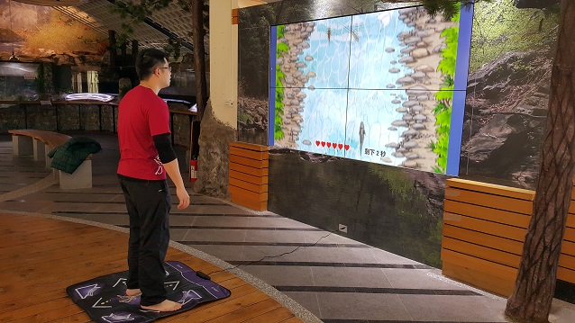

## 雪霸國家公園櫻花鉤吻鮭互動導覽程式
與台灣櫻花鉤吻鮭有關的互動遊戲，模擬國寶魚在溪流中的生態，遊客可藉由遊戲的互動內容，更加深入的認識國寶魚的棲地環境與生態知識。

### 2018年01月10日重新開放
位於台中市武陵地區的台灣櫻花鉤吻鮭生態中心展示館，經雪霸國家公園管理處進行展示更新工程已完工，訂於1月10日重新開放。雪霸處表示，台灣櫻花鉤吻鮭生態中心每天開放時間為上午9點至12點，下午1點至5點，歡迎遊客多加利用。

雪霸國家公園管理處表示，「國寶魚」台灣櫻花鉤吻鮭生態中心，是武陵地區遊客必訪的熱門景點之一，每年都有超過10萬人次前往展示館，瞭解台灣櫻花鉤吻鮭的保育成果。其中，最引人入勝的是模擬天然棲地的水族缸，可以近距離看到國寶魚在水中悠游的樣態，觀察其體側8到12個橢圓形的斑點。

雪霸處指出，由於台櫻花鉤吻鮭生態中心展示館於民國95年開幕啟用至今，歷經十餘年的歲月，展示館的展示面版、圖片及燈光設備等已陳舊極需改善。為此，生態中心展示館經過整修後，除館內解說版面資訊均已更新外，館內入口設有一面電視牆，有解說員為遊客解說有關國寶魚的保育策略、實際作為及保育成效。

館內更新增了與台灣櫻花鉤吻鮭有關的互動遊戲，遊戲內容共分五關，模擬國寶魚在溪流中的生態，利用遊戲機上下左右的移動，來躲避天敵或是天災，遊客可藉由遊戲的互動內容，更加深入的認識國寶魚的棲地環境與生態知識。